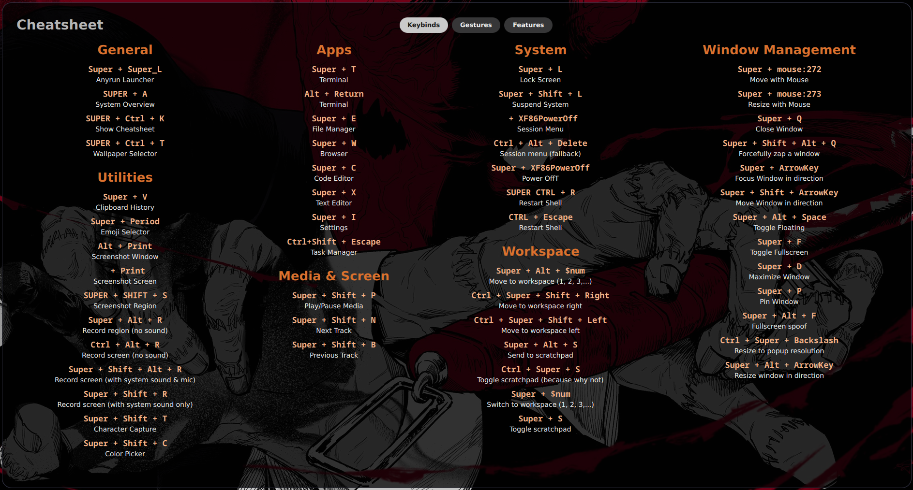
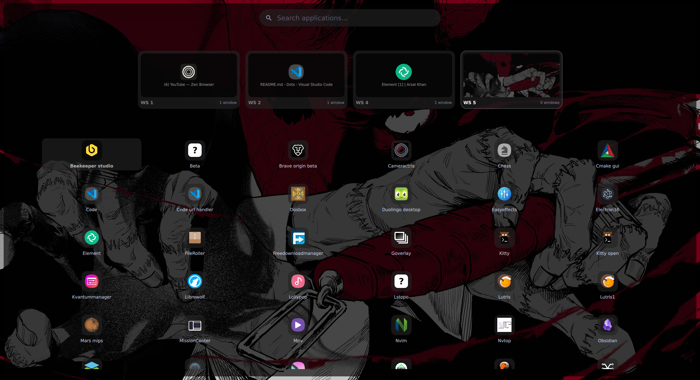
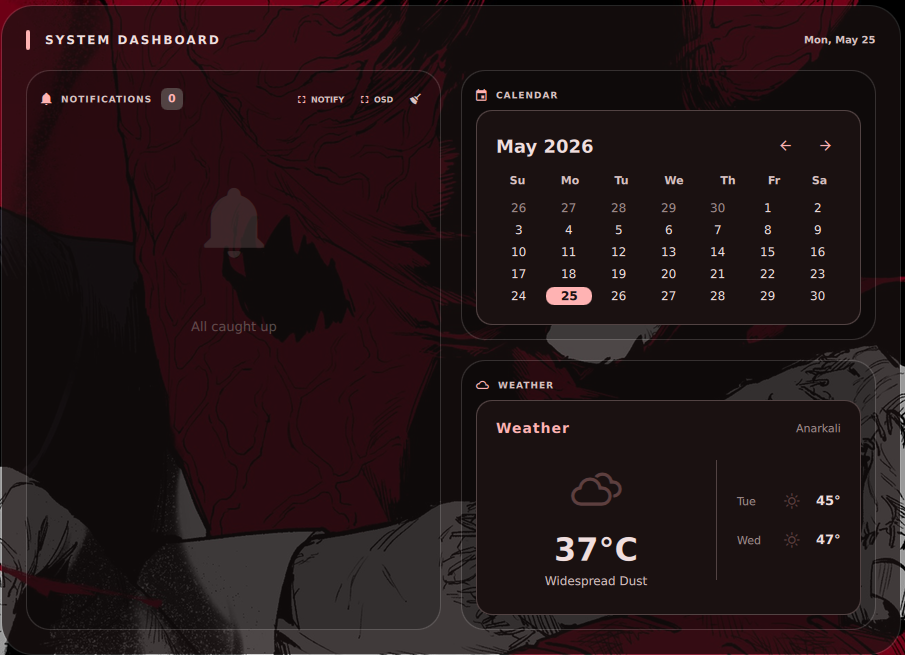
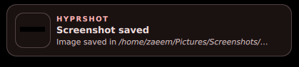

# Zenith Shell

A dynamic, aesthetically pleasing shell built with [Quickshell](https://github.com/outfoxxed/quickshell).

## Features
- **Dynamic Theming**: Adapts to your system.
- **Wallpaper Manager**: Built-in wallpaper and live wallpaper (video) support via `swww` and `mpvpaper`.
- **Network Manager**: Integrated wifi management using `iwctl`.
- **Media Player**: MPRIS support.
- **System Stats**: CPU, RAM, Temperature monitoring.

---

## 📸 Showcase

See Zenith Shell in action:

[](https://www.youtube.com/watch?v=09G4APMCORQ)

### Gallery

|  |  |
|:---:|:---:|
| **Clean Desktop & Bar** | **System Dashboard** |

|  |  |
|:---:|:---:|
| **Media Player Widget** | **Workspace Overview** |

|  |  |
|:---:|:---:|
| **Keybinds Cheatsheet** | **Kitty Terminal** |

---

## Dependencies

Ensure you have the following installed on your system:

- **Core**:
  - `quickshell` (The shell engine)
  - `qt6-declarative` / `qt6-base` (Qt6 dependencies)

- **Wallpaper & Video**:
  - `swww` (Static wallpapers)
  - `mpvpaper` (Live wallpapers)
  - `ffmpeg` (Thumbnail generation)

- **Network**:
  - `iwd` (`iwctl` command)
  - `rfkill` (Airplane mode)
  - `curl` (Speed test)

- **Utilities**:
  - `python3`
  - `python3-pillow` (Image processing for thumbnails)
  - `xdg-user-dirs` (Directory detection)
  - `socat` (IPC, optional but recommended)
  - `inotify-tools` (Network state monitoring)

## Installation

1. Clone the repository:
   ```bash
   git clone https://github.com/yourusername/zenith-shell.git
   mv zenith-shell $HOME/.config/.quickshell
   ```

2. Install python dependencies:
   ```bash
   pip3 install Pillow --break-system-packages
   # Or better, use your distro's package manager:
   # Arch: sudo pacman -S python-pillow
   # Debian/Ubuntu: sudo apt install python3-pil
   ```

3. Launch the shell:
   ```bash
   quickshell
   ```

## Wallpaper Selector

To launch the wallpaper selector UI:
```bash
./launch.sh wallpaperSelector
```
This script will automatically detect the installation path.

## Configuration

The shell uses `awww` for wallpapers. Ensure `awww-daemon` is running or let the shell start it.
Wifi configuration uses `iwctl`. You might need sudo privileges or be in the `network` group.
